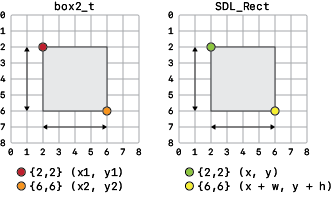

# Math

## vec2_t

Represents a vector in two-dimensional space.

```cpp
struct vec2_t {
    float x, y;
};
```

### Using vec2_t

```cpp
#include "math/vec2.hpp"
using namespace math; // OPTIONAL
```

```cpp
math::vec2_t vec(10, 10);
// OR
math::vec2_t vec = {10, 10};
// OR
math::vec2_t vec(vec_to_copy); // Copy constructor
```

#### Operations

**min**

Set both axes to the smallest of both values.

```cpp
auto vec = {10, 10};
vec.min({5, 15}); // Returns {5, 10}
```

**max**

Set both axes to the largest of both values.

```cpp
auto vec = {10, 10};
vec.max({5, 15}); // Returns {10, 15}
```

**clamp**

Clamp both axes between a minimum and maximum value.

```cpp
auto vec = {-1, 1000};
vec.clamp(0, 999); // Returns {0, 999}
```

**to_string**

Returns a user friendly string representation.

```cpp
auto vec = {42, 69};
printf("%s\n", vec.to_string().c_str());
```

Outputs:

```
{x=42, y=69}
```

#### Operators

**Add**

```cpp
// Copy
vec + 10 // Add scalar
vec + vec // Add vectors

// Reference
vec += 10 // Add scalar
vec += vec // Add vectors
```

**Subtract**

```cpp
// Copy
vec - 10 // Sub scalar
vec - vec // Sub vectors

// Reference
vec -= 10 // Sub scalar
vec -= vec // Sub vectors
```

**Multiply**

```cpp
// Copy
vec * 10 // Multiply scalar
vec * vec // Multiply vectors

// Reference
vec *= 10 // Multiply scalar
vec *= vec // Multiply vectors
```

**Divide**

```cpp
// Copy
vec / 10 // Divide scalar
vec / vec // Divide vectors

// Reference
vec /= 10 // Divide scalar
vec /= vec // Divide vectors
```

**Increment/decrement**

```cpp
++vec // Increment
--vec // Decrement
```

**Equality**

```
vec == vec
vec != vec
```

## box2_t

Represents a rectangular shape in two-dimensional space.

```cpp
struct box2_t {
    vec2_t min, max;
};
```

### Using box2_t

```cpp
#include "math/box2.hpp"
using namespace math; // OPTIONAL
```

```cpp
math::box2_t box(math::vec2_t(0, 0), math::vec2_t(10, 10));
// OR
math::box2_t box = {{0, 0}, {10, 10}};
// OR
math::box2_t box(box_to_copy); // Copy constructor
```

#### Operations

**size**

Returns the size of the rectangle.

```cpp
auto box = {{5, 5}, {15, 15}};
auto.size(); // Returns {10, 10}
```

**center**

Returns the center point of the rectangle.

```cpp
auto box = {{0, 0}, {10, 10}};
auto.center(); // Returns {5, 5}
```

**to_string**

Returns a user friendly string representation.

```cpp
auto box = {{0, 0}, {10, 10}};
printf("%s\n", box.to_string().c_str());
```

Outputs:

```
{min={x=0, y=0}, max={x=10, y=10}}
```

**contains**

Checks if the rectangle contains a point or rectangle.

```cpp
auto box = {{0, 0}, {10, 10}};

// Point
box.contains({5, 5}); // Returns true
box.contains({11, 11}); // Returns false

// Rectangle
box.contains({{4, 4}, {8, 8}}); // Returns true
box.contains({{8, 8}, {11, 11}}); // Returns false
```

**intersects**

Checks if the rectangle intersects with another rectangle.

```cpp
auto box = {{0, 0}, {10, 10}};
box.intersects({{5, 5}, {15, 15}}); // Returns true
box.intersects({{11, 11}, {15, 15}}); // Returns false
```

#### Operators

**Equality**

```
box == box
box != box
```

#### Casting

Aditionally, you can cast *box2_t* to *SDL_Rect*. While doing this, you'll have to remember that *box2_t* handles coordinates differently. Where *SDL_Rect* uses a position and size, *box2_t* uses a start and end position.

[](img/rectangles.png)

```cpp
math::box2_t box = {{10, 10}, {30, 30}};
SDL_Rect rect = (SDL_Rect) box;
```
